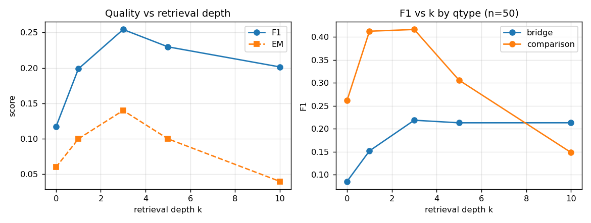
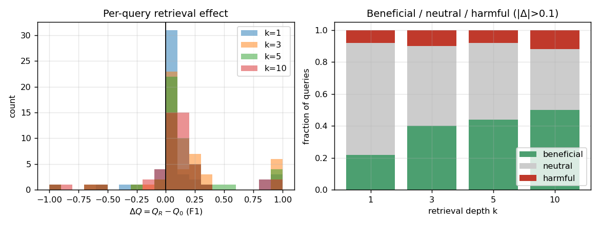
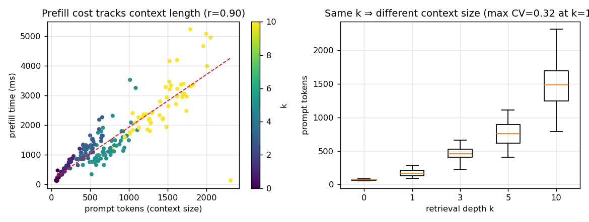
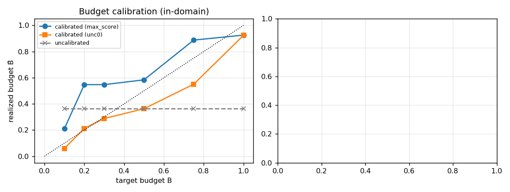
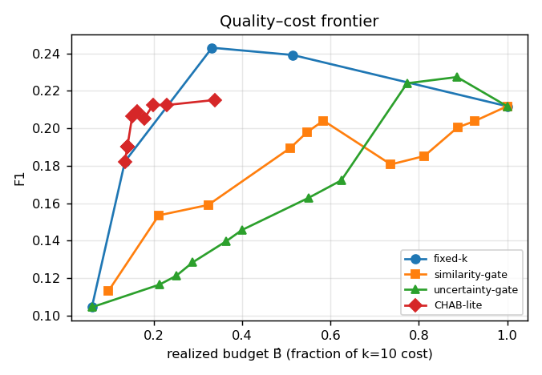

# CHAB-RAG — Preliminary Results (smoke test)

Model: `qwen2.5:3b-instruct` (CPU, Ollama) · n=50 HotpotQA (distractor) questions · k∈[0, 1, 3, 5, 10] · retriever=bm25

> Sanity pilot only — small N, single backbone, single dataset. Numbers are indicative feasibility signals, not publication results.

## 1. Quality vs retrieval depth

Mean F1 by k: k=0: 0.117, k=1: 0.199, k=3: 0.254, k=5: 0.230, k=10: 0.201

**Peak F1 at k=3.** Non-monotonic (inverted-U) benefit reproduced.

## 2. Retrieval harm (RQ3 / H3)

- k=1: beneficial 22%, neutral 70%, harmful 8%
- k=3: beneficial 40%, neutral 50%, harmful 10%
- k=5: beneficial 44%, neutral 48%, harmful 8%
- k=10: beneficial 50%, neutral 38%, harmful 12%

## 3. Cost is driven by context length, not document count (RQ4 / C3)

- corr(context size in tokens, prefill time) = **0.90** (context chars vs prefill: 0.90)
- corr(context chars, total time) = **0.86**
- k is a monotone but coarse proxy: corr(k, prefill time) = **0.84**, yet within a single k the context size still varies (max coefficient of variation **0.32** at k=1) — equal-document-count queries differ materially in prefill/decode cost.
- 0 pathological CPU stall(s) excluded from the cost analysis (decode tail latency is noisy on shared CPU; motivates measuring TPOT(L) curves properly).

## 4. Budget calibration (RQ2 / H2)

- max_score: mean |B̂−B| = **0.167**, max = 0.347
- unc0: mean |B̂−B| = **0.080**, max = 0.200
- uncertainty_uncalibrated: mean |B̂−B| = **0.275**, max = 0.637

## 5. Quality–cost frontier & matched-budget comparison (RQ1/RQ5)

CHAB-lite ΔQ predictor quality (corr of predicted vs actual ΔF1 on the held-out split) = **-0.29** — a deliberately simple ridge model; a weak value indicates the cheap features under-predict retrieval benefit at this scale.

Table = best quality achievable **within** each target budget (realized ≤ target).

|   target_B | policy           |   realized_B |    F1 |   EM |   harm_rate |   mean_k |
|-----------:|:-----------------|-------------:|------:|-----:|------------:|---------:|
|        0.3 | fixed-k          |        0.134 | 0.182 | 0.08 |        0.12 |     1    |
|        0.3 | similarity-gate  |        0.211 | 0.154 | 0.04 |        0    |     1.6  |
|        0.3 | uncertainty-gate |        0.288 | 0.129 | 0.04 |        0.04 |     2.4  |
|        0.3 | CHAB-lite        |        0.23  | 0.212 | 0.12 |        0.12 |     2.04 |
|        0.5 | fixed-k          |        0.332 | 0.243 | 0.12 |        0.12 |     3    |
|        0.5 | similarity-gate  |        0.323 | 0.159 | 0.04 |        0.04 |     2.8  |
|        0.5 | uncertainty-gate |        0.4   | 0.146 | 0.04 |        0.04 |     3.6  |
|        0.5 | CHAB-lite        |        0.339 | 0.215 | 0.12 |        0.12 |     3.04 |
|        1   | fixed-k          |        0.332 | 0.243 | 0.12 |        0.12 |     3    |
|        1   | similarity-gate  |        1     | 0.212 | 0.04 |        0.16 |    10    |
|        1   | uncertainty-gate |        0.886 | 0.227 | 0.08 |        0.12 |     8.8  |
|        1   | CHAB-lite        |        0.339 | 0.215 | 0.12 |        0.12 |     3.04 |

## 6. Reading for the proposal

- Use Sections 1–3 as the *premise evidence* (Sec. 2/3/9 of the proposal): benefit is non-uniform and non-monotonic, and document count is a poor cost proxy.
- Use Section 4 as a *feasibility demo* of realized-budget calibration (E2/E6), and Section 5 as a template for the matched-budget table (Sec. 12.8).
- Next steps: scale N, add a second backbone, and add the evidence-allocation level.
