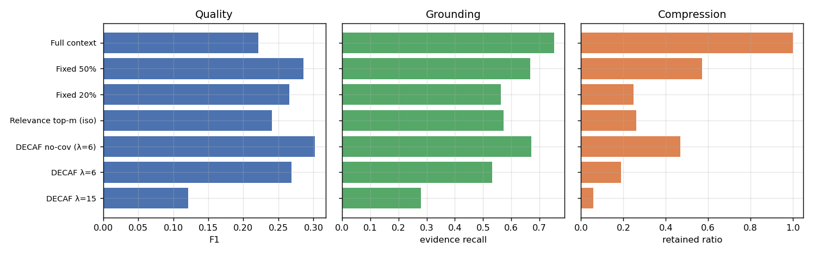

# DECAF — Preliminary Results (smoke test)

CPU-only, `qwen2.5:3b-instruct` via Ollama (llama.cpp) · 10 scaling runs · 210 compression runs

> CPU-only pilot on one 3B quantized model. Absolute numbers are machine-specific; the **shapes and break-even behaviour** are the point.

**Bottom line.** TPOT grows **linearly** with context length (TPOT ≈ 36.5 + 0.725×L ms per 1k tok, r²=0.68); prefill ≈ 4114.4 ms per 1k tok (r²=1.00).

## 1. Decode scaling (RQ1 / E1, E8)

|    L |   prompt_tokens |   prefill_ms |   decode_ms |   tpot_ms |   ttft_ms |   e2e_ms |   total_ms |   decode_share |   prefill_ms_per_tok |
|-----:|----------------:|-------------:|------------:|----------:|----------:|---------:|-----------:|---------------:|---------------------:|
|  256 |           362   |      1091.4  |     1176.68 |     36.77 |   1103.27 |  2281.61 |    2268.08 |           0.52 |                 3.01 |
|  512 |           645   |      2124.17 |     1211.83 |     37.87 |   2136.04 |  3350.32 |    3336    |           0.36 |                 3.29 |
| 1024 |          1178.5 |      4322.26 |     1184.3  |     37.01 |   4345.56 |  5530.22 |    5506.57 |           0.22 |                 3.67 |
| 2048 |          2240.5 |      8447.47 |     1182.01 |     36.94 |   8490.56 |  9680.19 |    9629.48 |           0.12 |                 3.77 |
| 4096 |          4355.5 |     17506.7  |     1286.15 |     40.19 |  17577.4  | 18874    |   18792.8  |           0.07 |                 4.02 |

- With a median generation of **32 tokens**, decode and prefill are equal at **L ≈ 414 tokens**; below that decode dominates, above it **prefill** dominates.
- **H1 verdict: refuted on this setup.** Decode's share of end-to-end latency *decreases* with context length (0.52 → 0.07), because prefill grows ~4 ms/token while TPOT is nearly flat (+0.7 ms per 1k tokens). Compression therefore helps mostly through prefill/TTFT, not TPOT — the opposite of the proposal's CPU hypothesis, which holds only for very short contexts or much longer generations.

## 2. Break-even context length L* (RQ2 / E3, E4)

- compressor overhead T_compress = **1.36 ms**; retained context L_c ≈ **205 tokens**.
- solving the fitted curves gives **L\* ≈ 205 tokens**: below it compression is a net latency loss, above it a net win.
- **H2 verdict: supported, but the threshold is trivial on CPU.** Compressor overhead (~1.4 ms) is negligible next to the per-token prefill cost (~4 ms/token), so L* collapses to ≈ the retained length: compression is a **net latency win for any context longer than the retained budget**. The binding constraint is quality/grounding, not latency.

## 3. Compression: quality, grounding, latency (RQ3 / E2, E7)

| method                |    F1 |    EM |   ev.recall |   ev.prec |   gold_in_ev |   retained |   compress_ms |   e2e_ms |   net_S |
|:----------------------|------:|------:|------------:|----------:|-------------:|-----------:|--------------:|---------:|--------:|
| DECAF λ=15            | 0.122 | 0.1   |       0.279 |     0.578 |        0.2   |      0.059 |          1.38 |   1146.7 |    3.24 |
| DECAF λ=6             | 0.268 | 0.2   |       0.532 |     0.403 |        0.6   |      0.19  |          1.36 |    987.5 |    3.76 |
| DECAF no-cov (λ=6)    | 0.302 | 0.2   |       0.671 |     0.201 |        0.733 |      0.47  |          1    |   1503.7 |    2.47 |
| Fixed 20%             | 0.265 | 0.233 |       0.562 |     0.315 |        0.6   |      0.249 |          1.03 |    911.9 |    4.07 |
| Fixed 50%             | 0.285 | 0.2   |       0.668 |     0.162 |        0.767 |      0.572 |          1.09 |    949.1 |    3.91 |
| Full context          | 0.221 | 0.1   |       0.751 |     0.097 |        0.833 |      1     |          0.84 |   3712.7 |    1    |
| Relevance top-m (iso) | 0.24  | 0.167 |       0.573 |     0.423 |        0.567 |      0.261 |          1.12 |   1172.3 |    3.17 |

## 4. Component analysis (RQ3 / §17)

- Iso-budget relevance baseline vs DECAF(decaf_lam6): F1 0.240→0.268, evidence recall 0.573→0.532, gold-in-evidence 0.567→0.600 at the same retained count.
- **H3 verdict: not supported.** DECAF does not beat fixed-ratio selection on the quality–latency frontier (fixed-50% F1 0.285 and fixed-20% 0.265 vs DECAF-λ6 0.268) and only edges the iso-budget relevance baseline. On this pilot the CPU-cost and coverage terms add little over a plain relevance ranking.

- **Note (reassuring for the proposal's motivation):** moderate compression *improves* F1 (full 0.221 → fixed-50% 0.285) while cutting latency ~4×, because distractor context hurts the small model; but grounding degrades monotonically with retained evidence (gold-in-evidence 0.833 → 0.60 → 0.20), so accuracy alone would hide the cost.

## 5. Reading for the proposal

- §1 gives the **measured TPOT(L)/prefill(L)** curves that underlie the break-even analysis.
- §2 gives a concrete **L\*** from the fitted curves plus measured compressor overhead.
- §3–4 give the **quality–latency–grounding Pareto** and the CPU-awareness ablation.
- Next: Q4/Q8 and 3B/7B pairs, long-context sets (LongBench), a cross-encoder scorer, and more queries.
