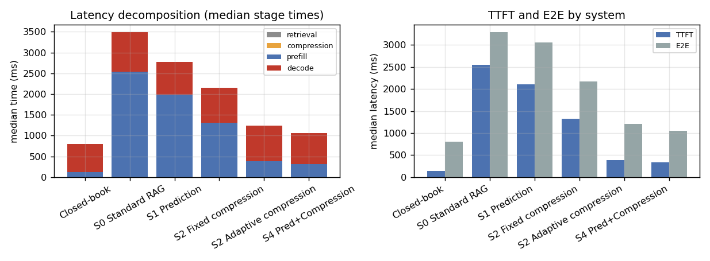
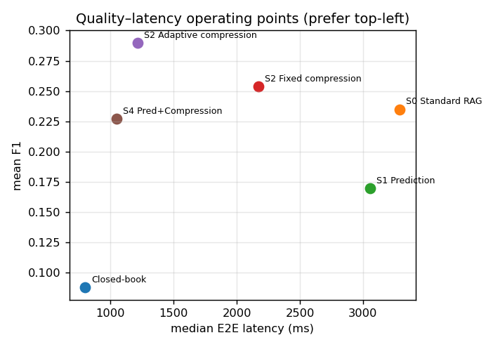
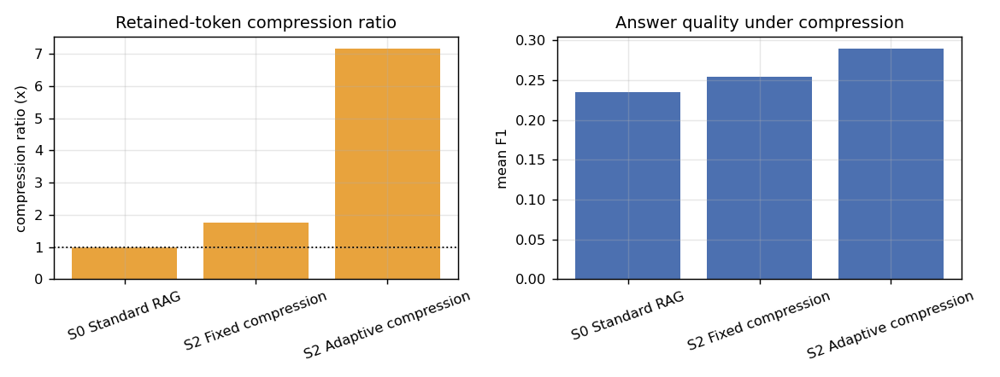
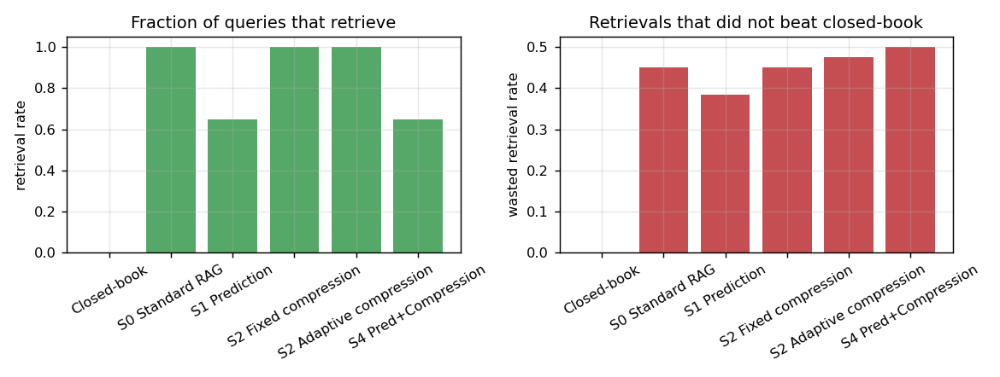
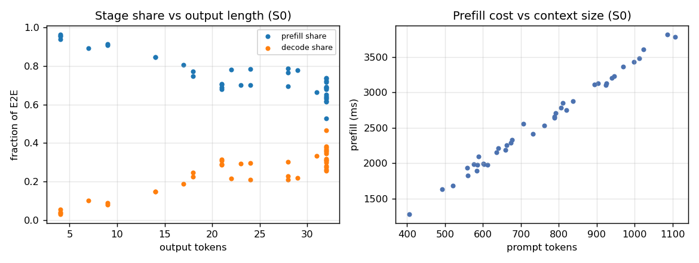

# PACER — Preliminary Results (smoke test)

Model: `qwen2.5:3b-instruct` (CPU, Ollama) · n=40 HotpotQA (distractor) · top_k=5 · 4-bit-class local inference

> CPU-only pilot. Absolute latencies do not transfer to GPU; results test the **coordination mechanism and relative effects**, not published speedup numbers. KV-cache reuse (S3/S5–S7) is Phase-2 in the proposal and is out of scope here.

**Bottom line.** S4 (prediction + adaptive compression) runs at **1047 ms E2E vs 3292 ms for S0** (~68% lower) with **statistically indistinguishable quality** (F1 0.23 vs 0.23; paired CI includes 0). Adaptive compression alone (S2) is already strong; the incremental gain of adding the prediction gate over compression-only is small and not significant at n=40.

## 1. System summary

| system      |   n |   ttft_ms |   e2e_ms |   f1 |   em |   prompt_tokens |   output_tokens |   retrieval_rate |   wasted_retrieval_rate |   compression_ratio |   policy_overhead_ms |   retrieval_ms |   compression_ms |
|:------------|----:|----------:|---------:|-----:|-----:|----------------:|----------------:|-----------------:|------------------------:|--------------------:|---------------------:|---------------:|-----------------:|
| closed_book |  40 |    134.47 |   799.27 | 0.09 | 0.02 |           70.95 |           16.95 |             0    |                    0    |                1    |                 0    |           0    |             0    |
| S0_full     |  40 |   2555.47 |  3291.66 | 0.23 | 0.1  |          755.18 |           23.08 |             1    |                    0.45 |                1    |                 1.42 |           1.42 |             0    |
| S1          |  40 |   2102.81 |  3056.53 | 0.17 | 0.05 |          537.38 |           21.18 |             0.65 |                    0.38 |                1    |                 1.1  |           1.1  |             0    |
| S2_fixed    |  40 |   1319.46 |  2169.65 | 0.25 | 0.12 |          474.72 |           20.78 |             1    |                    0.45 |                1.76 |                 2.4  |           1.35 |             0.98 |
| S2_adaptive |  40 |    392.07 |  1213.12 | 0.29 | 0.2  |          250.2  |           20.42 |             1    |                    0.48 |                7.17 |                 2.49 |           1.54 |             0.98 |
| S4          |  40 |    332.4  |  1047.05 | 0.23 | 0.15 |          206.6  |           19.5  |             0.65 |                    0.5  |                4.17 |                 2.01 |           1.17 |             0.79 |

## 2. Latency decomposition (H5)

Stage medians show how much of E2E is retrieval + prefill vs decode. On this CPU/3B setup, decode dominates the non-retrieval path, and the controller's own overhead (retrieval + compression, ~2.5 ms) is negligible next to prefill/decode.

## 3. Quality–latency operating points (RQ1 / H1)

## 4. Compression: ratio vs quality (H2 / RQ2)

## 5. Retrieval accounting: wasted retrieval (H1)

- S4 retrieval rate: **0.65** vs S0 full retrieval **1.00**.
- S4 wasted-retrieval rate: **0.50**.

## 6. Workload regime (H5)

- corr(output tokens, decode share of E2E) = **0.88** — as generations lengthen, retrieval-side optimization matters less.

## 7. Paired statistics (S4 vs components)

Paired across identical query IDs; bootstrap 95% CI on the mean difference, Wilcoxon signed-rank p, Holm–Bonferroni adjustment, Cliff's delta effect size.

|   n |   mean_diff |      ci_lo |      ci_hi |      p |   cliff_delta | a   | b           | metric   | better   |   p_holm |
|----:|------------:|-----------:|-----------:|-------:|--------------:|:----|:------------|:---------|:---------|---------:|
|  40 |  -2279.99   | -2505.9    | -2052.91   | 0      |       -0.9738 | S4  | S0_full     | e2e_ms   | lower    |   0      |
|  40 |     -0.0081 |    -0.1407 |     0.1352 | 0.5388 |       -0.1206 | S4  | S0_full     | f1       | higher   |   1      |
|  40 |  -1473.4    | -1832.35   | -1114.94   | 0      |       -0.5475 | S4  | S1          | e2e_ms   | lower    |   0      |
|  40 |      0.057  |    -0.0283 |     0.1522 | 0.6496 |       -0.01   | S4  | S1          | f1       | higher   |   1      |
|  40 |    -65.2044 |  -205.487  |    90.9596 | 0.0962 |       -0.1075 | S4  | S2_adaptive | e2e_ms   | lower    |   0.3848 |
|  40 |     -0.063  |    -0.1611 |     0.0327 | 0.1007 |       -0.1206 | S4  | S2_adaptive | f1       | higher   |   0.3848 |

## 8. Reading for the proposal

- §1–2 give the **latency decomposition** needed for the S0 reference and H5.
- §3 is the **RQ1 operating-point view** (S4 vs S0/S1/S2 at matched quality budget).
- §4–5 give the **compression quality bill** and the **wasted-retrieval** accounting (H1/H2).
- §6–7 supply the **statistical protocol** (paired CI + Wilcoxon + Holm + effect size).
- Next: add KV-cache reuse (S3/S5–S7), a real GPU run, and cross-model/dataset generalization.
