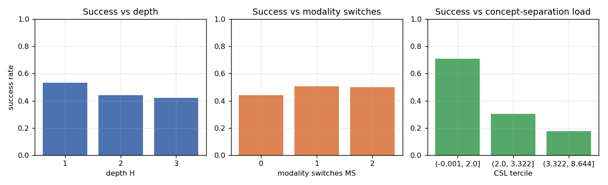
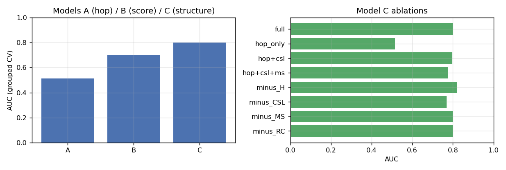
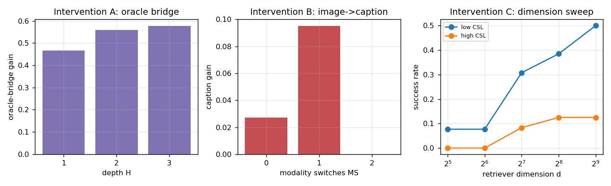
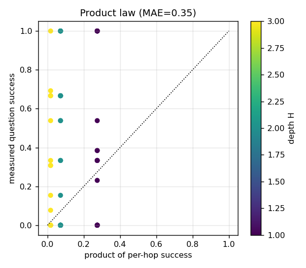

# SDM-MAR — Preliminary Results (smoke test)

Synthetic multimodal evidence-graph corpus; real LLM reader `qwen2.5:3b-instruct` (CPU, Ollama) · 60 questions · 790 agent runs

> **Harness check, not a discovery.** Structure (H, CSL, MS, edge types) is planted by construction, so structure-to-success links are partly expected. H and CSL are driven by the real LLM reader (its disambiguation under hard negatives); the image-modality barrier is **simulated** (the pilot's reader is text-only and cannot perform OCR). See Section 3.

**Bottom line.** Grouped-CV AUC — Model A (hop count) **0.514**, Model B (retrieval score) **0.701**, Model C (structure) **0.800**; ΔAUC(C−A) = **0.286** (clustered 95% CI [0.142, 0.432]).

## 1. Success vs structure (baseline)

- overall baseline success = **0.467**
- by depth H: H=1: 0.53, H=2: 0.44, H=3: 0.42
- hop success by node modality: I: 0.20, T: 0.34

## 2. Prediction: Models A/B/C and ablations

|    |   auc |   brier |   logloss |   cal_slope |   cal_intercept |
|:---|------:|--------:|----------:|------------:|----------------:|
| A  | 0.514 |   0.252 |     0.698 |      -0.189 |          -0.158 |
| B  | 0.701 |   0.216 |     0.628 |       0.779 |           0.002 |
| C  | 0.8   |   0.177 |     0.557 |       0.76  |          -0.052 |

Ablations (grouped CV AUC):

| variant    |   n_features |   auc |   brier |   logloss |   cal_slope |   cal_intercept |
|:-----------|-------------:|------:|--------:|----------:|------------:|----------------:|
| full       |            9 | 0.8   |   0.177 |     0.557 |       0.76  |          -0.052 |
| hop_only   |            1 | 0.514 |   0.252 |     0.698 |      -0.189 |          -0.158 |
| hop+csl    |            2 | 0.797 |   0.18  |     0.552 |       0.894 |          -0.008 |
| hop+csl+ms |            3 | 0.778 |   0.187 |     0.578 |       0.771 |          -0.002 |
| minus_H    |            8 | 0.82  |   0.172 |     0.527 |       0.907 |          -0.026 |
| minus_CSL  |            8 | 0.769 |   0.198 |     0.613 |       0.695 |          -0.049 |
| minus_MS   |            8 | 0.8   |   0.177 |     0.556 |       0.766 |          -0.053 |
| minus_RC   |            8 | 0.8   |   0.177 |     0.557 |       0.76  |          -0.052 |

## 3. Interventions

- **Intervention A (oracle bridge)** — gain by depth H: 1: +0.47, 2: +0.56, 3: +0.58; prediction 'grows with H' → **confirmed**.
- **Intervention B (image→caption)** — gain by MS: 0: +0.03, 1: +0.10, 2: +0.00; on chains with/without image nodes: False: -0.07, True: +0.09; prediction 'helps image chains' → **confirmed**.
- **Intervention C (dimension sweep)** — success gain from d=32→512: low CSL +0.42, high CSL +0.12; prediction 'gain grows with CSL' → **not confirmed**.
- Note: the dimension sweep is weakly identified in this synthetic corpus, because high-CSL distractors differ from gold mainly by a random identifier token, so no embedding dimension separates them; a real corpus should not have this degeneracy.

## 4. Hop-level analysis and the product law

- MAE(product of per-hop success, measured question success) = **0.350**; corr = **0.10**
- The product of marginal per-hop success is determined almost entirely by H, so it tracks the measured rate poorly and generally under-estimates it: hop outcomes are strongly dependent (a wrong bridge degrades the next hop), not independent. The Fréchet bounds are in `product_law.csv`. A genuine per-question hop model with an error-propagation term (proposal Section 12.5) is the correct next step.

## 5. Reading for the proposal

- Section 2 is the **head-to-head predictive test** (Models A/B/C, ΔAUC with clustered CI).
- Section 3 gives the **three one-factor interventions** with their pre-stated directions.
- Section 1 & 4 give the **structure-to-success** and **hop-level product-law** evidence.
- Next: replace the simulated modality barrier with a real VLM, use real multimodal corpora (CrossModalQA / VisDocAgentBench), and scale questions and replicates.
